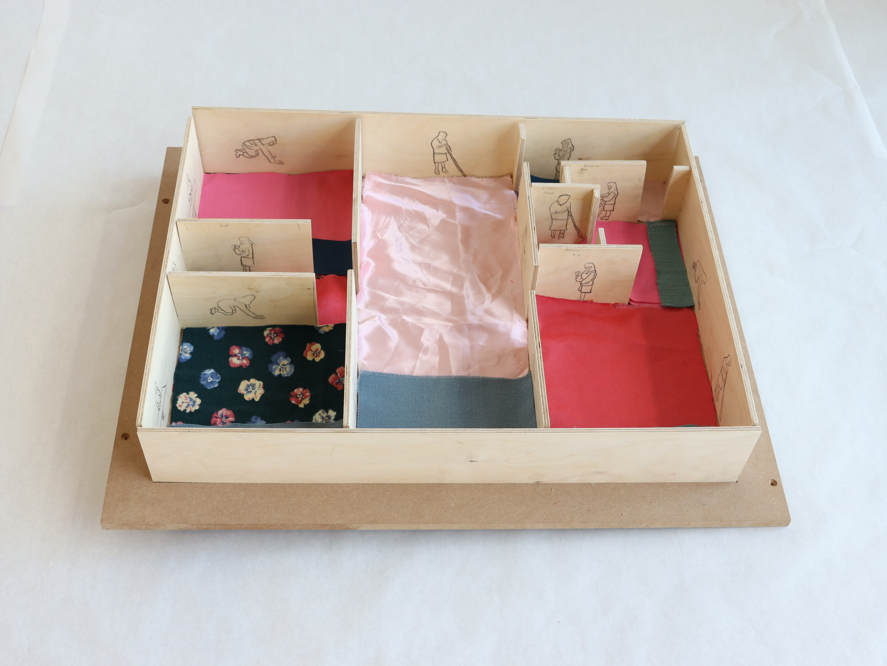
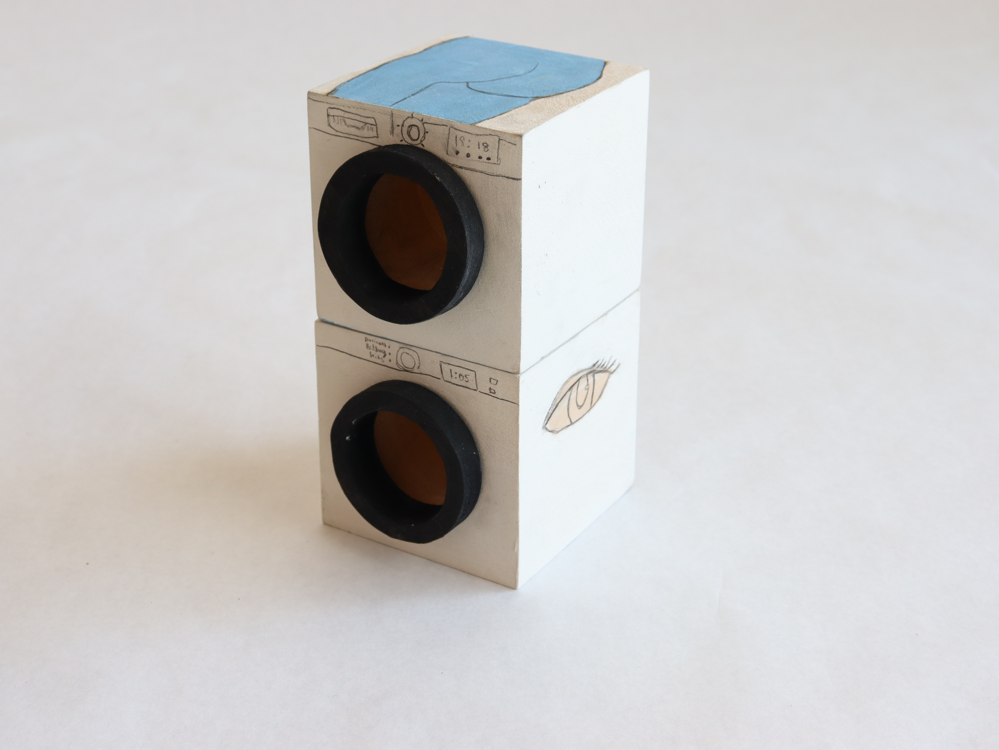
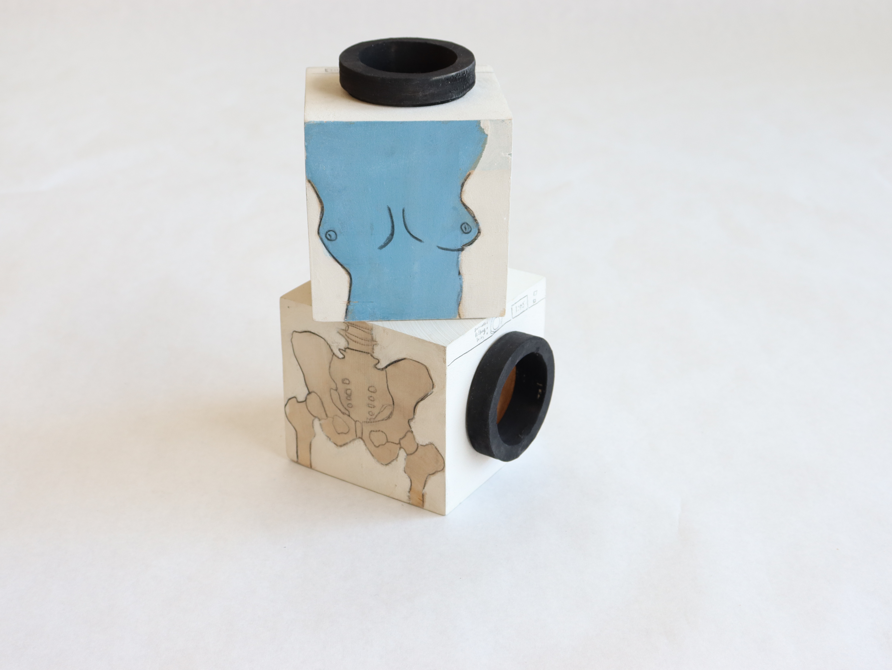

---
format:
  html:
    theme: cosmo
    toc: false
    include-after-body: carousel.js

---
# Design Projects


```{=html}
<!-- Bootstrap JS for sliding -->
<script src="https://cdn.jsdelivr.net/npm/bootstrap@5.3.0/dist/js/bootstrap.bundle.min.js"></script>

<!-- SIMPLE IMAGE SLIDESHOW -->
<div id="myCarousel" class="carousel slide" data-bs-ride="carousel" data-bs-interval="7000" style="width:80%; margin:auto; margin-bottom:40px;">

  <div class="carousel-inner">

    <div class="carousel-item active">
      
    </div>

    <div class="carousel-item">
      
    </div>

    <div class="carousel-item">
      
    </div>

  </div>

</div>
```

Across these projects, I learned how hands-on making can strengthen the same skills I rely on as a prospective data scientist. I learned  careful observation, structured experimentation, patience in iteration, and attention to meaning beyond the surface, these things can get lost in the hurried timing of finding meaning in quantitative data. Each assignment reconnected me with creativity, something that  I feel like I often lose in academic settings, and it reminded me that analytical work and artistic work both require curiosity, resilience, and a willingness to explore uncertainty. Together, these projects helped me find balance between technical thinking and joyful, intuitive making  both of which shape the type of data scientist I hope to become. 


I've used parts of the data that I collected and reflected throughout these projects.

# Women’s Divisions of Labor — Model House Project

The Model House project focused on representing women’s traditional divisions of labor within the home. I created a small house model that highlights domestic tasks typically assigned to women, using objects and layout to visualize how responsibility is divided across different spaces. The project illustrates how labor is organized, distributed, and often overlooked in everyday household environments.


# Papermaking

The Papermaking project involved creating handmade sheets of paper using a pulp mixture enriched with ingredients meaningful to me, including salt and chile flakes. I formed, pressed, and dried the sheets, resulting in paper that physically incorporated elements tied to my family and cultural background.


