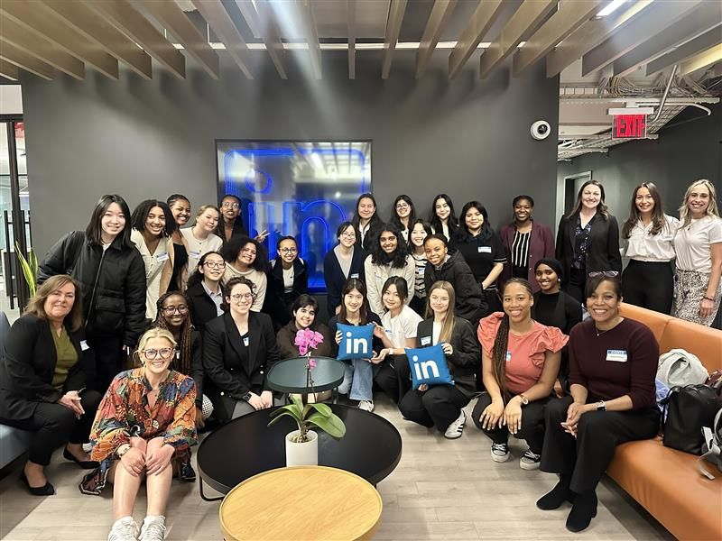
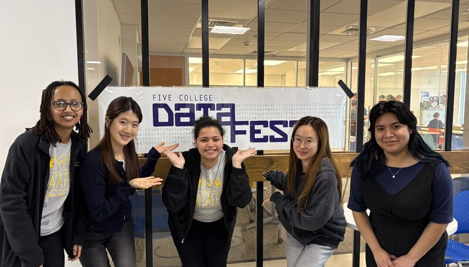

```{=html}
<!-- Bootstrap JS for sliding -->
<script src="https://cdn.jsdelivr.net/npm/bootstrap@5.3.0/dist/js/bootstrap.bundle.min.js"></script>

<!-- SIMPLE IMAGE SLIDESHOW -->
<div id="myCarousel" class="carousel slide" data-bs-ride="carousel" data-bs-interval="7000" style="width:80%; margin:auto; margin-bottom:40px;">

  <div class="carousel-inner">

    <!-- MUST BE ACTIVE -->
    <div class="carousel-item active">
      
    </div>

    <div class="carousel-item">
      
    </div>

  </div>

</div>

```


 
## Research Projects
Most of my research lies at the intersection of Psychology and Statistics, with a focus on identity groups.


- **Microaggressions in Doctor–Patient Relationships**  
  Investigating how subtle discriminatory behaviors influence patient outcomes and emotional responses.

- **Leukemia Classification Based on Gene Type Using Lasso Regression and Elastic Net**  
  Built classification models using genomic features to differentiate leukemia subtypes.  
  📄 *[Click here to view the PDF](golub.pdf)*


## Competitions
- **WIDS Datathon 2025**  
  Studied brain activity patterns associated with ADHD; analyzed differences between males and females.  
  🔗 <https://github.com/wu-ada/wids-adhd-in-women2>

- **Five College Datafest 2025 – Savilis Real Estate Market and Industry**  
  Determined optimal New York City office locations based on industry clustering and demographic/business factors.  
  📄 *[Click here to view the PDF](Databosses_Datafest_2025.pdf)*


## R Package
- **chchchanges**  
  Package developed as part of SDS 270 for detecting sudden shifts in time-series data.  
  🔗 <https://github.com/sds270-f24/chchchanges>

