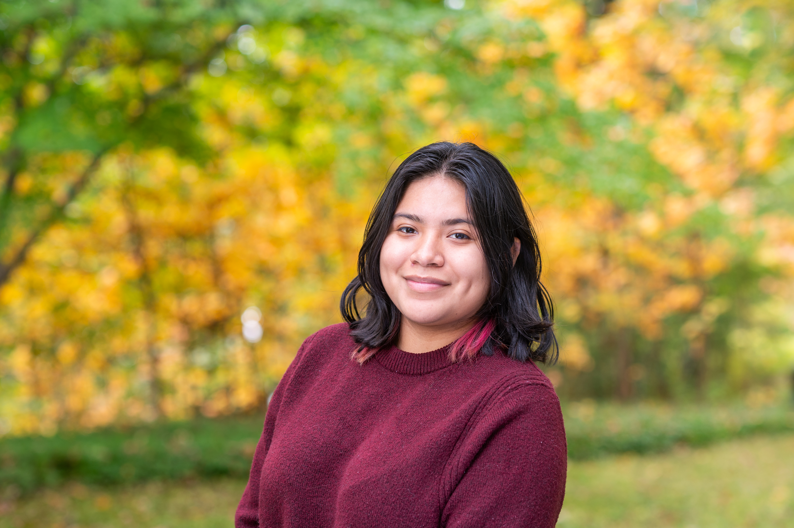
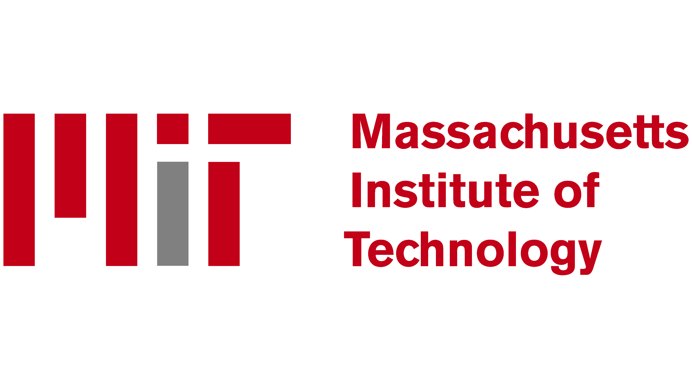
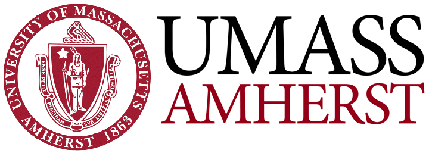
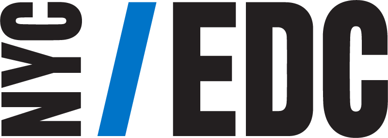
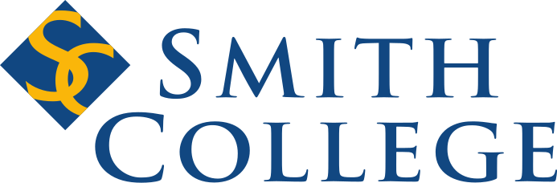
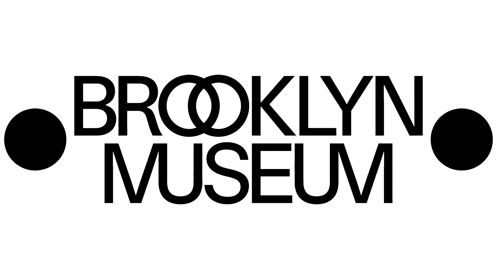

<h1 style="font-size:38px; font-weight:600; margin-top:20px;">Nicole Sanchez Flores</h1>

  

<!-- LEFT SIDE -->

## Welcome to my website

I’m **Nicole Sanchez Flores**, an undergraduate at **[Smith College](https://www.smith.edu/)** double majoring in **Statistics & Data Science and Psychology**. I am passionate about using data to understand human behavior, health, and social outcomes.

I enjoy combining research, programming, and statistical modeling to explore meaningful questions most espeically  in **health analytics, machine learning, and social science research**.

 

## Current Work
- Researching microaggressions and doctor–patient relationships with **[Dr. Amanda Almond](https://www.citytech.cuny.edu/faculty/AAlmond)**, presenting at the **[Eastern Psychological Association Conference](https://www.easternpsychological.org/i4a/pages/index.cfm?pageID=3501)**
- Peer Advisor at the **[Lazarus Center for Career Development](https://www.smith.edu/about-smith/lazarus-center-career-development)**
- First Gen Outloud Intern supporting first-generation student success

 

## Explore
- [About Me](about.html)  
- [Research & Projects](research.html)  
- [Résumé](ALL RESUMES AND FELLOWSHIP.pdf)  
- [LinkedIn](https://www.linkedin.com/in/nicolesanchezflores/)  
- Email: <nsanchezflores@smith.edu>

::: {.column width="60%"}
## Experience Timeline

  
   <strong>2024 – Present</strong> Break Through Tech AI — MIT

  
   <strong>2024</strong> Biostatistics Summer Research — UMass Amherst

  
   <strong>2023</strong> NYCEDC — Human Resources Analytics Intern

  
   <strong>2023 – Present</strong> Peer Advisor — Lazarus Center for Career Development

  
   <strong>2022</strong> Artist Assistant / Teen Teacher — Brooklyn Museum

:::
